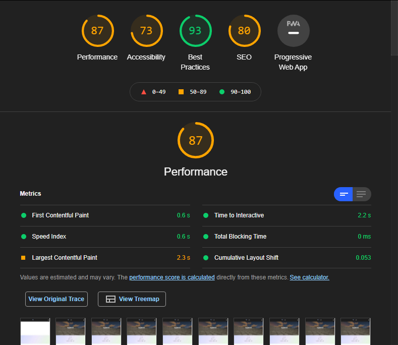
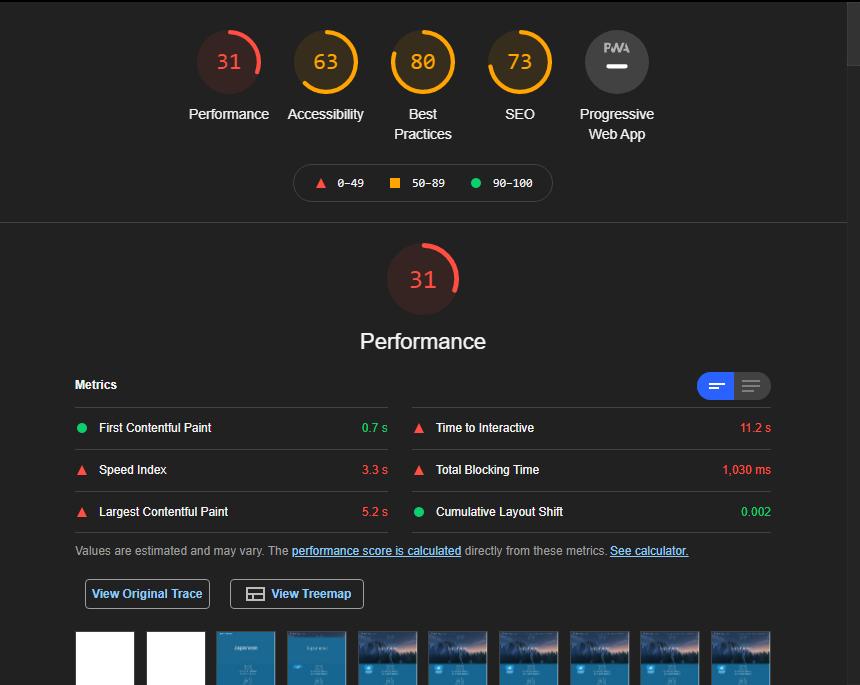

# Issues with the Digital Portfolio
The whole reason why I decided to recode Deltaline in HTML was mainly because I already knew how to do code in HTML, and in Python. Soon I will be moving it to Vue.js and/or Django (to hopefully to use python as well). The Google Sites version has some major issues, and mostly regarding load times. 

## Loading Times

*Lighthouse Test on the Google Sites version (the jpn page)*

*Lighthouse Test on the self-made (hosted on Netifly) version (jpn page)*

As you can see, there is a massive improvement when it comes in loading times with the self-coded version. This was done on my laptop running the latest version of chrome and running Windows 10 Pro as well. All the conditions were the same when testing (the same chrome extensions, etc)

This was one of the biggest reasons why I decided to make the website myself. Without Google's slow font api, and with full control over how I add images and other content, this allows for a lag-free experience. I'll try my best to reduce as much lag as possible.

## How the Website Looks 

Google Sites is very basic in design; it was meant to be easily deployed without having to touch any of the HTML, CSS, PHP, JS, or .Net code and framework. And since it's very basic in design, it doesn't allow for much control and how the website is built. Essentially, it's just the worse version of wordpress. So I decided to just rewrite the whole entire thing from the start. 

## The Problem with Deltaline 

The point is to have a fully optimized site, where things load in much quicker. It's actually done it's job, but the one big issue is regarding the load times of the SeeSaw iFrames. This is what's causing the lag. SeeSaw doesn't have any API's or REST APIs that I can integrate into, but maybe python's Django framework might help here.
## Optimizations

Google Sites only accepts .png, .jpg, and .gif image files. Nothing else. This isn't good for a website where it needs to load in HD assets, and takes a toll on Google Sites. With Netifly, it allows for compression and combined with Cloudflare, it allows for a very fast loading experience. In order to optimize the website, I used only svg files in order to reduce loading times, and mainly used the Bootstrap lib for mobile support. Since Seesaw doesn't have an api, I'm stuck with using iFrames in order to get it to work (or embed videos). The PageSpeed score isn't that good, but it seems like it loads a lot faster compared to the google site version. This site heavily depends on caching and minifying HTML files in order to load faster

Timings: 

- Google Sites Version - ~ 30 secs
- Deltaline - ~ 8 secs 

The times are the ones that load the first seesaw iframe. 

## Possible Optimizations 

- Redis Cache
- Send everything to a MySQL database for search and other stuff (or NoSQL instead...)
- Change all CSS files to SCSS
- If self hosting, switch to using Nginx or Apache instead
- Use NoSQL instead (MongoDB, Firebase, etc)

## Possible Addtions
- Search Function (MySQL + Apache Lucene)
